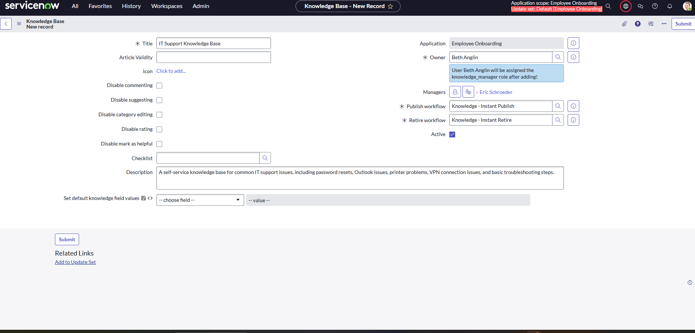
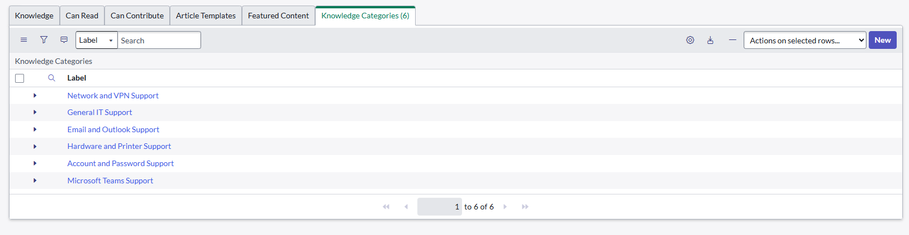
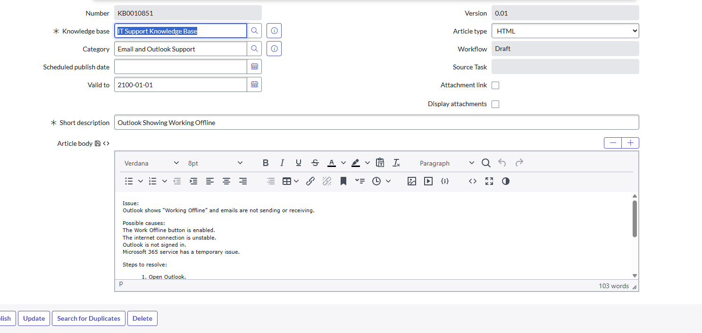
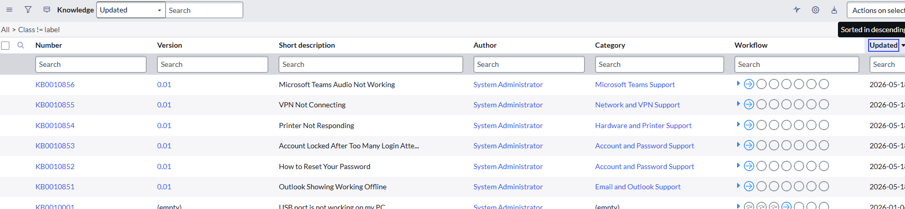
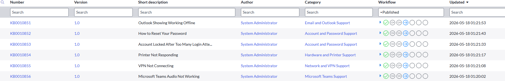
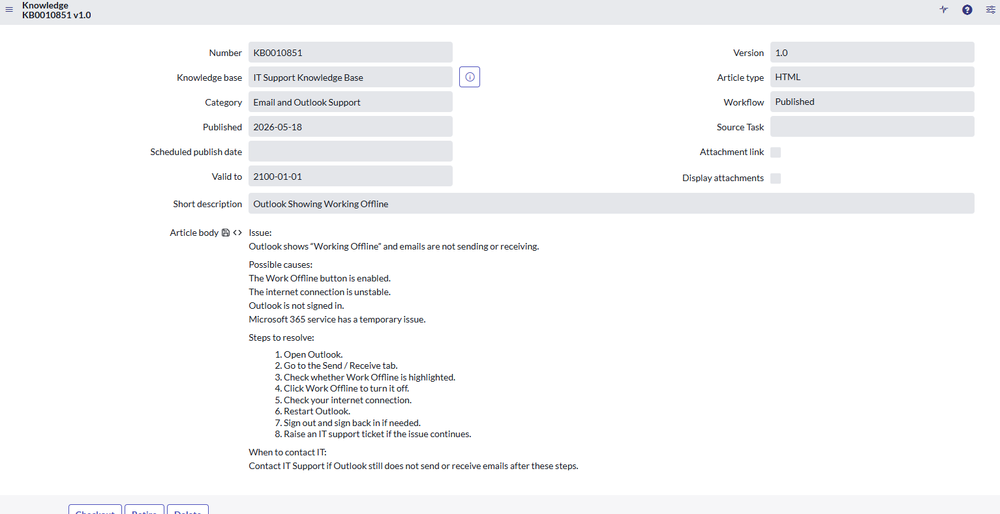

# ServiceNow IT Support Knowledge Base

## Project Overview

This project demonstrates the creation of an IT Support Knowledge Base in ServiceNow. The knowledge base was designed to help users find clear self-service troubleshooting guides for common IT support issues.

The project includes a dedicated knowledge base, organised support categories, and published knowledge articles for common service desk scenarios.

## Project Objectives

- Create a structured IT Support Knowledge Base
- Organise articles into clear support categories
- Write user-friendly troubleshooting guides
- Support self-service for common IT issues
- Demonstrate ServiceNow Knowledge Management skills

## Tools Used

- ServiceNow Developer Instance
- ServiceNow Knowledge Management
- Knowledge Articles
- Knowledge Categories

## Knowledge Categories Created

- Account and Password Support
- Email and Outlook Support
- Hardware and Printer Support
- Network and VPN Support
- Microsoft Teams Support
- General IT Support

## Knowledge Articles Created

- Outlook Showing Working Offline
- How to Reset Your Password
- Account Locked After Too Many Login Attempts
- Printer Not Responding
- VPN Not Connecting
- Microsoft Teams Audio Not Working

## Screenshots

### Knowledge Base Setup

### Knowledge Categories

### First Knowledge Article Form

### All Knowledge Articles in Draft

### All Knowledge Articles Published

### Published Outlook Knowledge Article

## Skills Demonstrated

- ServiceNow Knowledge Management
- IT support documentation
- Service desk troubleshooting
- Knowledge article creation
- Category management
- User self-service support
- Technical communication
- Process documentation

## Project Outcome

The final solution includes a published IT Support Knowledge Base with six troubleshooting articles across multiple service desk categories. The project shows how ServiceNow Knowledge Management can support users, reduce repeated support requests, and improve access to common troubleshooting steps.
